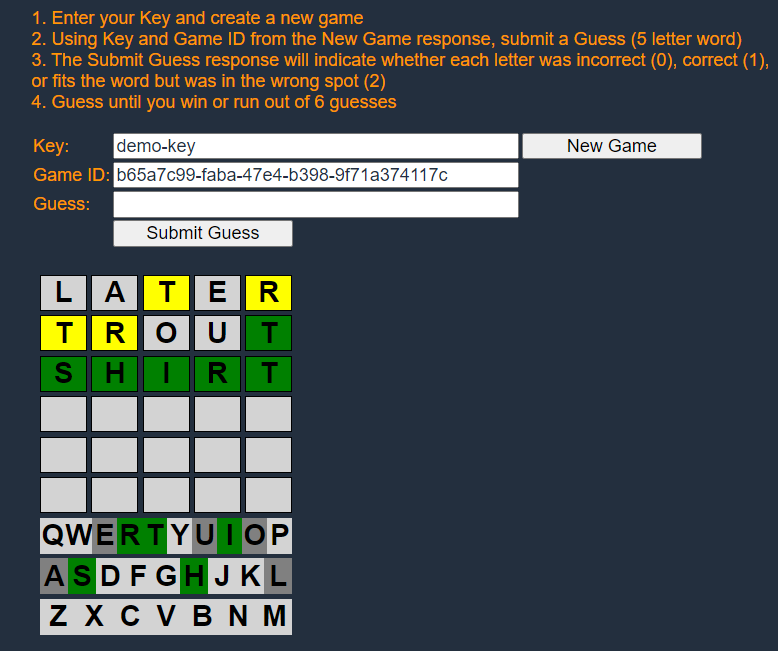
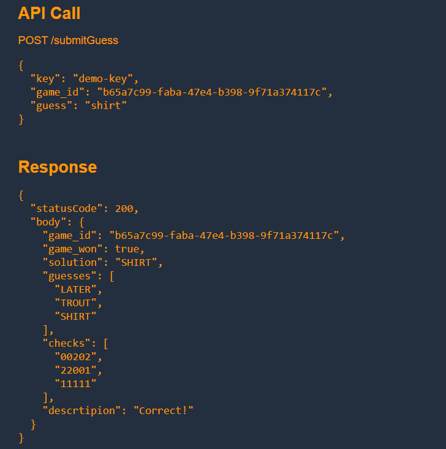

# Wordle API
  Objectives
- Build a simple API
- Gain familiarity with AWS services

  AWS Architecture
- APIs are hosted in API Gateway
- APIs call Lambda functions
- Data is stored in DynamoDB

  Screenshots from Wordle API Demo

